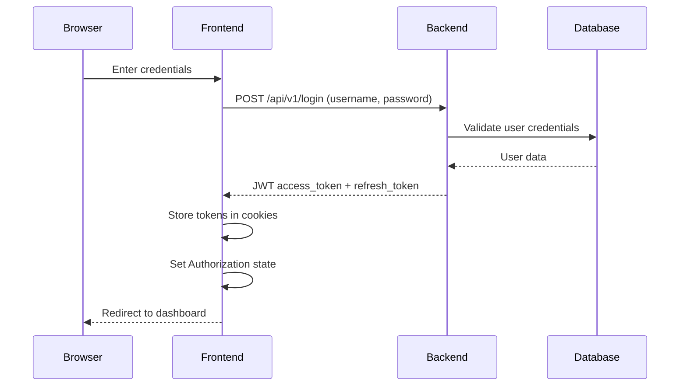
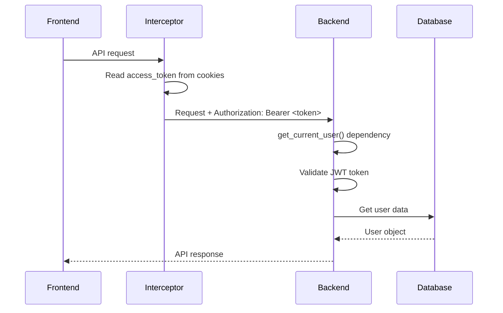
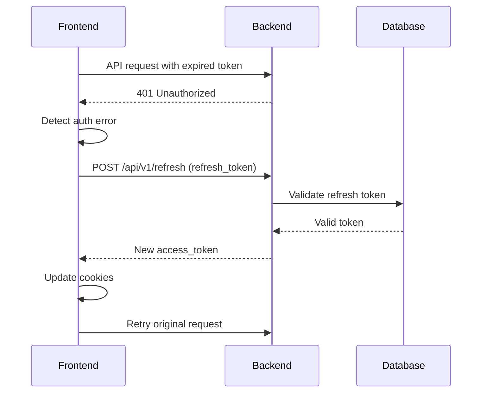

# Frontend & Backend Authentication Flow and Architecture

This document provides a comprehensive overview of how authentication and security are implemented across the Langflow frontend and backend systems.

## Backend Authentication Architecture

### Core Security Components

**FastAPI Security Dependencies:**
- `CurrentActiveUser = Annotated[User, Depends(get_current_active_user)]` - Main user dependency
- `DbSession = Annotated[AsyncSession, Depends(get_session)]` - Database session
- Uses `Security()` and `Depends()` primitives for dependency injection

### Authentication Methods

#### 1. JWT Token Authentication
- **Token Type**: Bearer token using `oauth2_login = OAuth2PasswordBearer(tokenUrl="api/v1/login")`
- **Algorithm**: HS256 (configurable via `ALGORITHM` setting)
- **Expiration**: 1 hour for access tokens, 7 days for refresh tokens
- **Storage**: Cookies and Authorization headers

#### 2. API Key Authentication
- **Header Name**: `x-api-key`
- **Query Parameter**: `x-api-key`
- **Validation**: Database lookup via `check_key()` function
- **Usage**: Direct API access without session management

#### 3. Auto-Login Mode
- **Purpose**: Development fallback with security validation
- **Requirements**: Requires valid API key or explicit bypass setting
- **Security**: Strict environment-based validation

### Security Flow Implementation

**Primary Authentication Logic** (`src/backend/base/langflow/services/auth/utils.py:44-89`):

```python
async def api_key_security(
    query_param: Annotated[str, Security(api_key_query)],
    header_param: Annotated[str, Security(api_key_header)],
) -> UserRead | None:
    settings_service = get_settings_service()

    if settings_service.auth_settings.AUTO_LOGIN:
        # Get the first user with validation
        if not query_param and not header_param:
            if settings_service.auth_settings.skip_auth_auto_login:
                # Development-only fallback
                result = await get_user_by_username(db, settings_service.auth_settings.SUPERUSER)
                return UserRead.model_validate(result, from_attributes=True)
            raise HTTPException(
                status_code=status.HTTP_403_FORBIDDEN,
                detail="An API key must be passed as query or header",
            )
        result = await check_key(db, query_param or header_param)

    elif not query_param and not header_param:
        raise HTTPException(
            status_code=status.HTTP_403_FORBIDDEN,
            detail="An API key must be passed as query or header",
        )
    else:
        result = await check_key(db, query_param or header_param)
```

**User Authentication Chain** (`src/backend/base/langflow/services/auth/utils.py:150-200`):

```python
async def get_current_user(
    token: Annotated[str, Security(oauth2_login)],
    query_param: Annotated[str, Security(api_key_query)],
    header_param: Annotated[str, Security(api_key_header)],
    db: Annotated[AsyncSession, Depends(get_session)],
) -> User:
    if token:
        return await get_current_user_by_jwt(token, db)
    user = await api_key_security(query_param, header_param)
    if user:
        return user
    raise HTTPException(
        status_code=status.HTTP_403_FORBIDDEN,
        detail="Invalid or missing API key",
    )
```

### Configuration Settings

**Authentication Settings** (`src/backend/base/langflow/services/settings/auth.py:31-43`):

```python
class AuthSettings(BaseSettings):
    SECRET_KEY: SecretStr = Field(default=SecretStr(""))
    ALGORITHM: str = "HS256"
    ACCESS_TOKEN_EXPIRE_SECONDS: int = 60 * 60  # 1 hour
    REFRESH_TOKEN_EXPIRE_SECONDS: int = 60 * 60 * 24 * 7  # 7 days

    @property
    def AUTO_LOGIN(self) -> bool:
        from langflow.services.settings.security_config import get_security_config
        return get_security_config().auto_login_enabled

    @property
    def skip_auth_auto_login(self) -> bool:
        from langflow.services.settings.security_config import get_security_config
        return get_security_config().skip_authentication
```

### RBAC Integration

**Enhanced Security Enforcement:**
- Role-Based Access Control with `RequireFlowRead`/`RequireFlowWrite` decorators
- Runtime enforcement via `RBACRuntimeEnforcementService`
- Fine-grained permissions with workspace/project isolation
- Audit logging for security compliance

**Example Flow Endpoint Security** (`src/backend/base/langflow/api/v1/flows.py:22-24`):

```python
from langflow.services.auth.authorization_patterns import (
    get_enhanced_enforcement_context,
    RequireFlowRead,
    RequireFlowWrite
)
```

## Frontend Authentication Architecture

### Client-Side Token Management

**Authentication Context** (`src/frontend/src/contexts/authContext.tsx:34-40`):

```typescript
const [accessToken, setAccessToken] = useState<string | null>(
  getAuthCookie(cookies, LANGFLOW_ACCESS_TOKEN) ?? null,
);
const [apiKey, setApiKey] = useState<string | null>(
  getAuthCookie(cookies, LANGFLOW_API_TOKEN),
);
```

**Cookie Constants** (`src/frontend/src/constants/constants.ts:965-966`):
- `LANGFLOW_ACCESS_TOKEN = "access_token_lf"` - JWT token for session auth
- `LANGFLOW_API_TOKEN = "apikey_tkn_lflw"` - API key for direct auth
- `LANGFLOW_REFRESH_TOKEN` - Refresh token for token renewal

### Login Process Flow

**1. User Login** (`src/frontend/src/contexts/authContext.tsx:81-97`):

```typescript
function login(newAccessToken: string, autoLogin: string, refreshToken?: string) {
  setAuthCookie(cookies, LANGFLOW_ACCESS_TOKEN, newAccessToken);
  setAuthCookie(cookies, LANGFLOW_AUTO_LOGIN_OPTION, autoLogin);
  setLocalStorage(LANGFLOW_ACCESS_TOKEN, newAccessToken);

  if (refreshToken) {
    setAuthCookie(cookies, LANGFLOW_REFRESH_TOKEN, refreshToken);
  }
  setAccessToken(newAccessToken);
  setIsAuthenticated(true);
  getUser();
  getGlobalVariables();
}
```

**2. Login API Call** (`src/frontend/src/controllers/API/queries/auth/use-post-login-user.ts:12-25`):

```typescript
async function loginUserFn({ password, username }: LoginType): Promise<any> {
  const res = await api.post(
    `${getURL("LOGIN")}`,
    new URLSearchParams({
      username: username,
      password: password,
    }).toString(),
    {
      headers: {
        "Content-Type": "application/x-www-form-urlencoded",
      },
    },
  );
  return res.data;
}
```

### API Request Authentication

**Automatic Token Injection** (`src/frontend/src/controllers/API/api.tsx:152-167`):

```typescript
const requestInterceptor = api.interceptors.request.use(
  async (config) => {
    const accessToken = customGetAccessToken();

    if (accessToken && !isAuthorizedURL(config?.url)) {
      config.headers["Authorization"] = `Bearer ${accessToken}`;
    }

    return config;
  }
);
```

**Fetch Interceptor for Non-Axios Requests** (`src/frontend/src/controllers/API/api.tsx:48-63`):

```typescript
const unregister = fetchIntercept.register({
  request: (url, config) => {
    const accessToken = customGetAccessToken();

    if (!isExternalURL(url)) {
      if (accessToken && !isAuthorizedURL(config?.url)) {
        config.headers["Authorization"] = `Bearer ${accessToken}`;
      }
    }

    return [url, config];
  },
});
```

**Token Retrieval** (`src/frontend/src/customization/utils/custom-get-access-token.ts`):

```typescript
export const customGetAccessToken = () => {
  const cookies = new Cookies();
  return cookies.get(LANGFLOW_ACCESS_TOKEN);
};
```

### API Endpoint Access Example

**Projects API Request** (`src/frontend/src/controllers/API/queries/rbac/use-get-projects.ts:72-75`):

```typescript
const url = `${getURL("RBAC")}/projects/?${params.toString()}`;
const res = await api.get(url);
```

**URL Resolution** (`src/frontend/src/controllers/API/helpers/constants.ts:32`):
- `getURL("RBAC")` resolves to `/api/v1/rbac`
- Full URL becomes `/api/v1/rbac/projects/`
- Axios interceptor automatically adds `Authorization: Bearer <jwt_token>`

### Token Refresh & Error Handling

**Auto-Refresh Logic** (`src/frontend/src/controllers/API/api.tsx:71-98`):

```typescript
const isAuthenticationError =
  error?.response?.status === 403 || error?.response?.status === 401;

const shouldRetryRefresh =
  (isAuthenticationError && !IS_AUTO_LOGIN) ||
  (isAuthenticationError && !autoLogin && autoLogin !== undefined);

if (shouldRetryRefresh) {
  const stillRefresh = checkErrorCount();
  if (stillRefresh) {
    await tryToRenewAccessToken(error);
    const accessToken = customGetAccessToken();
  }
}
```

**Response Interceptor** (`src/frontend/src/controllers/API/api.tsx:66-106`):

```typescript
const interceptor = api.interceptors.response.use(
  (response) => {
    setHealthCheckTimeout(null);
    return response;
  },
  async (error: AxiosError) => {
    const isAuthenticationError =
      error?.response?.status === 403 || error?.response?.status === 401;

    if (shouldRetryRefresh) {
      await tryToRenewAccessToken(error);
    }

    return Promise.reject(error);
  },
);
```

## Complete Authentication Flow

### 1. User Login Sequence



### 2. Authenticated API Request Flow



### 3. Token Refresh Flow



## Security Architecture Summary

### Backend Security Layers
1. **FastAPI Dependencies**: Dependency injection for auth validation
2. **Multi-Method Auth**: JWT tokens, API keys, auto-login fallback
3. **RBAC Integration**: Role-based permissions and enforcement
4. **Database Validation**: Secure token/key verification
5. **Error Handling**: Consistent 403/401 responses

### Frontend Security Implementation
1. **Pure Client-Side**: No server-side session management
2. **Cookie Storage**: Secure token persistence
3. **Automatic Injection**: Axios/fetch interceptors for headers
4. **Token Refresh**: Seamless renewal on expiration
5. **Error Recovery**: Graceful auth failure handling

### Key Security Features
- **Stateless Authentication**: JWT-based with no server sessions
- **Token Rotation**: Automatic refresh token handling
- **RBAC Enforcement**: Fine-grained permission checking
- **Audit Logging**: Security event tracking
- **Environment Validation**: Development vs. production controls
- **API Rate Limiting**: Built-in request throttling
- **CORS Protection**: Cross-origin request security

This architecture provides enterprise-grade security while maintaining developer-friendly workflows and comprehensive audit capabilities.